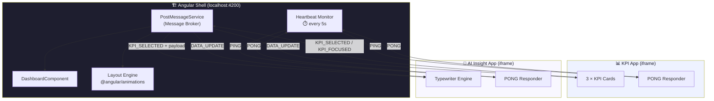
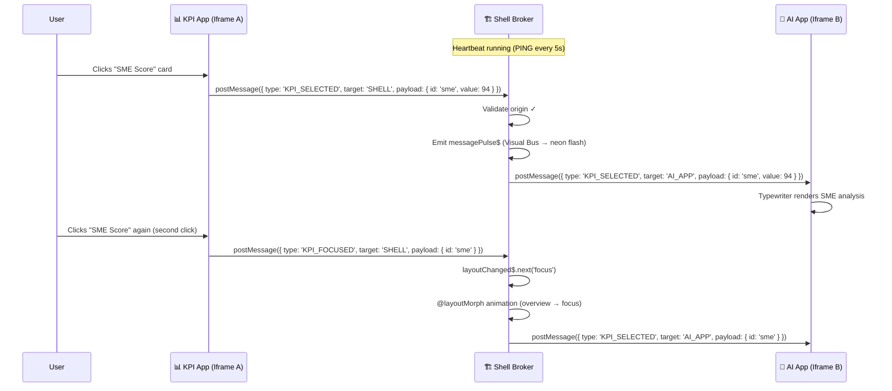
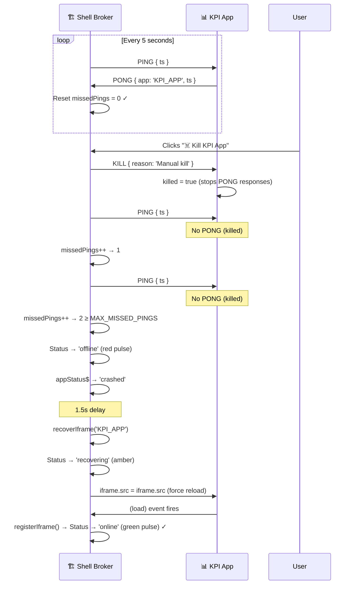

# 🏗️ Displify Shell — Micro-Frontend Iframe Architecture

> **Production-grade Angular 17+ shell** that orchestrates autonomous micro-apps through a centralized **Message Broker**, animated **Layout Engine**, and a self-healing **Heartbeat Monitor**.

---

## Table of Contents

1. [Executive Summary](#1-executive-summary)
2. [Architecture Diagram](#2-architecture-diagram)
3. [Communication Protocol](#3-communication-protocol)
4. [Resilience & Self-Healing](#4-resilience--self-healing)
5. [Security Matrix](#5-security-matrix)
6. [Layout Engine](#6-layout-engine)
7. [Setup & Deployment](#7-setup--deployment)
   - [7.1 URL Parameters](#71-url-parameters)
8. [Troubleshooting](#8-troubleshooting)

---

## 1. Executive Summary

**Displify Shell** implements the **Shell-and-Micro-app** pattern — a micro-frontend architecture where a host Angular application (the **Shell**) embeds multiple **autonomous web applications** inside `<iframe>` elements and coordinates them through the browser-native `window.postMessage` API.

### Key Characteristics

| Aspect | Detail |
|---|---|
| **Framework** | Angular 17.3+ (standalone components, Vite-powered dev server) |
| **Micro-app hosting** | `<iframe>` elements with `sandbox` attributes |
| **Communication** | Centralized **PostMessageService** (Message Broker) using `window.postMessage` |
| **Layout** | Flex-based responsive grid with `@angular/animations` morphing transitions |
| **Resilience** | Heartbeat PING/PONG monitor with automatic crash detection and iframe recovery |
| **Security** | `DomSanitizer` URL trust, `event.origin` validation, `sandbox` attribute enforcement |

### Shipped Micro-Apps

| App | File | Purpose |
|---|---|---|
| **KPI App** | `src/assets/kpi-app.html` | Displays 3 interactive KPI cards (SME Score, Revenue, Churn Rate) |
| **AI Insight App** | `src/assets/ai-app.html` | Renders AI-generated analysis with a typewriter effect for any selected KPI |

### How It Works in One Sentence

> A user clicks a KPI card in Iframe A → the Shell's Message Broker intercepts, routes, and forwards the event to Iframe B → the AI App renders the corresponding insight with a typewriter animation — all while a heartbeat monitor watches both iframes for failures.

---

## 2. Architecture Diagram

### System Overview



### Message Sequence — KPI Selection Flow



### Heartbeat & Recovery Sequence



---

## 3. Communication Protocol

### 3.1 The `IframeMessage` Interface

Every `postMessage` payload in the system **must** conform to this TypeScript interface:

```typescript
interface IframeMessage {
  type:    'KPI_SELECTED' | 'KPI_FOCUSED' | 'DATA_UPDATE'
         | 'CRASH_SIMULATION' | 'PING' | 'PONG' | 'KILL';
  target:  'SHELL' | 'KPI_APP' | 'AI_APP';
  payload: unknown;
}
```

| Field | Type | Purpose |
|---|---|---|
| **`type`** | String literal union | **Discriminated union** — determines how the broker interprets and routes the message |
| **`target`** | `'SHELL' \| 'KPI_APP' \| 'AI_APP'` | Declares the **intended recipient**. Messages targeting `'SHELL'` are routed internally; all others are forwarded to the named iframe |
| **`payload`** | `unknown` | Arbitrary data attached to the message. Structure varies by `type` (see table below) |

### 3.2 Message Type Reference

| Type | Direction | Payload Shape | Behavior |
|---|---|---|---|
| **`KPI_SELECTED`** | KPI → Shell → AI | `{ id: string, value: number }` | **First click** on a KPI card. Broker forwards to AI App (triggers typewriter insight). **No layout change.** Visual Bus neon flash fires. |
| **`KPI_FOCUSED`** | KPI → Shell → AI | `{ id: string, value: number }` | **Second click** on the same KPI card. Broker switches layout to `'focus'` mode (KPI panel expands to 100%) and forwards to AI App. |
| **`DATA_UPDATE`** | Shell → KPI / AI | `{ shellReady: boolean }` or custom | General-purpose data push from the Shell to any micro-app. Sent on iframe `(load)` to signal shell readiness. |
| **`CRASH_SIMULATION`** | KPI / AI → Shell | `{ app: 'KPI_APP' \| 'AI_APP' }` | Micro-app notifies the Shell that it is about to crash (reload). Shell marks the app as `'crashed'` (red dot) and auto-restarts after 1 s. |
| **`PING`** | Shell → KPI / AI | `{ ts: number }` | **Heartbeat probe** sent every 5 seconds. Each iframe must respond with a `PONG` within the next interval. |
| **`PONG`** | KPI / AI → Shell | `{ app: string, ts: number }` | **Heartbeat response.** Resets `missedPings` to 0 for the sending iframe. Handled silently (not pushed to `messages$`). |
| **`KILL`** | Shell → KPI | `{ reason: string }` | **Kill signal.** The receiving iframe sets a `killed` flag, stops responding to PINGs, and visually dims. The heartbeat monitor detects the silence and auto-recovers. |

### 3.3 Reactive Streams (RxJS)

The `PostMessageService` exposes the following Subjects for the `DashboardComponent` to subscribe to:

| Stream | Type | Purpose |
|---|---|---|
| `messages$` | `Subject<IframeMessage>` | Every validated inbound message (except `PONG`) |
| `layoutChanged$` | `Subject<LayoutState>` | Emits `'overview'` or `'focus'` when the layout needs to change |
| `messagePulse$` | `Subject<{ from, to }>` | Visual Bus — triggers neon border animation on the source/destination panels |
| `appStatus$` | `Subject<{ id, status }>` | Crash recovery status: `'healthy'` / `'crashed'` / `'recovering'` |
| `iframeHealth$` | `BehaviorSubject<Map<string, IframeHealthRecord>>` | Real-time heartbeat health snapshot per iframe (status, missedPings, lastPong timestamp) |

---

## 4. Resilience & Self-Healing

### 4.1 Heartbeat Monitor

The Shell runs a **heartbeat timer** that continuously validates the liveness of every registered micro-app.

| Parameter | Value | Configurable |
|---|---|---|
| **PING interval** | 5,000 ms | `PING_INTERVAL_MS` in `PostMessageService` |
| **Max missed PINGs** | 2 | `MAX_MISSED_PINGS` in `PostMessageService` |
| **Recovery delay** | 1,500 ms after offline detection | Hardcoded in `tick()` |

#### Lifecycle State Machine

```
┌──────────┐   iframe.onload    ┌──────────┐
│  (new)   │ ─────────────────► │  ONLINE  │ ◄──────────────────┐
└──────────┘   registerIframe() └────┬─────┘                    │
                                     │                          │
                              missedPings ≥ 2                   │
                                     │                     PONG received
                                     ▼                     or iframe reloads
                               ┌───────────┐                    │
                               │  OFFLINE  │                    │
                               └─────┬─────┘                    │
                                     │                          │
                              1.5s delay → restartApp()         │
                                     │                          │
                                     ▼                          │
                              ┌─────────────┐                   │
                              │ RECOVERING  │ ──────────────────┘
                              └─────────────┘
                               iframe.src = iframe.src
```

#### How the Broker Detects Silence

1. **Every 5 seconds**, `tick()` iterates over `healthMap`.
2. For each iframe **not** already in `'recovering'` state, it **increments** `missedPings`.
3. If `missedPings >= 2` and status is not already `'offline'`:
   - Status → `'offline'`
   - `appStatus$` emits `'crashed'` (drives the red pulse dot in the UI)
   - `setTimeout(() => recoverIframe(id), 1500)` schedules auto-recovery
4. After the health check, `tick()` sends a `PING` to every active iframe.
5. When a `PONG` arrives, `handlePong()` resets `missedPings = 0` and updates `lastPong`.

#### Why `while(true){}` Doesn't Work for Kill Simulation

Same-origin iframes (`assets/kpi-app.html` served from `localhost:4200`) share the **same JavaScript thread** as the Angular shell. A blocking `while(true){}` would freeze the shell's `setInterval` heartbeat timer too — making detection impossible.

**Solution:** The `KILL` handler sets a `killed = false` → `true` flag. The iframe remains alive but **silently drops all PONG responses**, allowing the shell's heartbeat to detect the silence normally.

### 4.2 Crash Recovery Flow

When a micro-app sends `CRASH_SIMULATION` (or is detected as offline by the heartbeat):

1. **Immediate:** `appStatus$` emits `{ id, status: 'crashed' }` → red pulsing dot appears
2. **After delay:** `restartApp(id)` is called:
   - `appStatus$` emits `'recovering'` → amber dot
   - `healthMap[id].status = 'recovering'` (heartbeat skips this iframe during recovery)
   - `iframe.src = iframe.src` forces a full page reload inside the iframe
3. **On `(load)` event:** `registerIframe()` resets health to `'online'` → green pulse dot

### 4.3 System Health Dashboard

The toolbar's **System Health** section provides real-time monitoring:

| Indicator | Color | Animation | Meaning |
|---|---|---|---|
| 🟢 Green pulse | `#22c55e` | Gentle 2s glow breathe | Iframe is **online** — responding to PINGs |
| 🔴 Red pulse | `#ef4444` | Fast 700ms opacity flash | Iframe is **offline** — missed ≥ 2 PINGs |
| 🟡 Amber pulse | `#f59e0b` | 800ms linear blink | Iframe is **recovering** — reload in progress |

Tooltips show the raw health data: `"KPI App — ONLINE (missed 0)"`.

---

## 5. Security Matrix

### 5.1 DomSanitizer Usage

Angular's security model **blocks** dynamic iframe `src` bindings by default. The Shell uses `DomSanitizer.bypassSecurityTrustResourceUrl()` to explicitly mark micro-app URLs as trusted:

```typescript
this.kpiAppUrl = this.sanitizer.bypassSecurityTrustResourceUrl('assets/kpi-app.html');
this.aiAppUrl  = this.sanitizer.bypassSecurityTrustResourceUrl('assets/ai-app.html');
```

> ⚠️ **Production guidance:** Only call `bypassSecurityTrustResourceUrl()` on URLs that are **hardcoded** or sourced from a **trusted configuration service**. Never pass user-supplied input.

### 5.2 Iframe Sandbox Attributes

Each `<iframe>` element uses the `sandbox` attribute to apply a least-privilege security policy:

```html
<iframe sandbox="allow-scripts allow-same-origin allow-forms" ...>
```

| Permission | Granted | Why |
|---|---|---|
| `allow-scripts` | ✅ | Micro-apps need JavaScript execution |
| `allow-same-origin` | ✅ | Required for `postMessage` origin to match (otherwise origin becomes `'null'`) |
| `allow-forms` | ✅ | Permits form submissions inside micro-apps |
| `allow-popups` | ❌ | Prevents micro-apps from opening pop-ups |
| `allow-top-navigation` | ❌ | Prevents micro-apps from navigating the parent shell |
| `allow-modals` | ❌ | Prevents `alert()`, `confirm()`, `prompt()` |

### 5.3 Origin Validation

The Message Broker validates `event.origin` against a whitelist before processing any inbound message:

```typescript
private readonly allowedOrigins: string[] = [
  'http://localhost:4200',   // Shell itself (same-origin iframes)
  'http://localhost:4201',   // External micro-app port A
  'http://localhost:4202',   // External micro-app port B
];

private isOriginAllowed(origin: string): boolean {
  return this.allowedOrigins.includes(origin);
}
```

**Messages from untrusted origins are silently dropped** with a console warning:

```
[Broker] Blocked message from untrusted origin: https://evil.example.com
```

> **Production hardening:** Replace the hardcoded array with an environment-driven configuration. Consider using `targetOrigin` (second argument to `postMessage`) instead of `'*'` for outbound messages:
> ```typescript
> iframe.contentWindow.postMessage(message, 'https://kpi.example.com');
> ```

### 5.4 Content-Security-Policy Recommendations

For production deployment, add the following CSP headers to your web server:

```
Content-Security-Policy:
  default-src 'self';
  script-src  'self' 'unsafe-inline';
  style-src   'self' 'unsafe-inline';
  frame-src   'self' https://kpi.example.com https://ai.example.com;
  connect-src 'self' https://api.example.com;
```

| Directive | Value | Purpose |
|---|---|---|
| `frame-src` | Explicit micro-app domains | **Only** listed origins can be loaded in `<iframe>` elements |
| `script-src` | `'self' 'unsafe-inline'` | Required for inline scripts in standalone HTML micro-apps. Prefer `'nonce-…'` in production |
| `frame-ancestors` | `'self'` (on micro-app servers) | Prevents your micro-apps from being embedded by unauthorized hosts |

### 5.5 PONG Sender Identification

The broker identifies which iframe sent a `PONG` by matching `event.source` (the `Window` reference) against the registered iframe elements:

```typescript
private identifySender(sourceWindow: Window): string | null {
  for (const [id, iframe] of this.iframeRegistry.entries()) {
    if (iframe.contentWindow === sourceWindow) {
      return id;
    }
  }
  return null;
}
```

This prevents a rogue iframe from sending a spoofed `PONG` on behalf of another iframe.

---

## 6. Layout Engine

### 6.1 Two Layout States

The Shell supports two layout modes, controlled by the `LayoutState` type:

```typescript
type LayoutState = 'overview' | 'focus';
```

| State | KPI Panel | AI Panel | Trigger |
|---|---|---|---|
| **`overview`** | `flex: 1 1 70%` | `flex: 1 1 30%` (visible) | Default / "← Back to Overview" button |
| **`focus`** | `flex: 1 1 100%` | `flex: 0 0 0%` (hidden, translated right) | Double-click (second click) on a KPI card (`KPI_FOCUSED`) |

### 6.2 Flex-Based Grid

The dashboard uses a **flexbox** container (not CSS Grid) to allow smooth animated transitions between states:

```scss
.dashboard-grid {
  display: flex;
  height: calc(100vh - 52px);
  overflow: hidden;
}

.layout-overview {
  .kpi-panel { flex: 1 1 70%; }
  .ai-panel  { flex: 1 1 30%; opacity: 1; transform: translateX(0); }
}

.layout-focus {
  .kpi-panel { flex: 1 1 100%; }
  .ai-panel  { flex: 0 0 0%; opacity: 0; transform: translateX(60px); }
}
```

### 6.3 Angular Animation Triggers

Two `@angular/animations` triggers power the visual transitions:

#### `@layoutMorph`

Drives the panel resize with a staggered feel:

| Transition | KPI Panel | AI Panel |
|---|---|---|
| `overview → focus` | 400ms ease-in-out to `flex: 1 1 100%` | 400ms + 80ms delay to `flex: 0 0 0%`, `opacity: 0`, `translateX(60px)` |
| `focus → overview` | 350ms ease-in-out to `flex: 1 1 70%` | 350ms + 60ms delay to `flex: 1 1 30%`, `opacity: 1`, `translateX(0)` |

#### `@neonPulse` (Visual Bus)

Applied to each panel wrapper. Flashes an indigo glow when data flows through:

| State | Style |
|---|---|
| `idle` | `box-shadow: 0 0 0 0 transparent` |
| `active` | `box-shadow: 0 0 12px 2px rgba(99, 102, 241, 0.7)` |

Timing: `idle → active` in 150ms, `active → idle` in 400ms. The source panel fires first, the destination 200ms later, and both reset after 700ms.

---

## 7. Setup & Deployment

### 7.1 URL Parameters

The shell supports query parameters to control display mode, toolbar visibility, and signage timing without any code changes.

| Parameter | Values | Default | Description |
|---|---|---|---|
| `mode` | `signage` | *(none)* | Enables autoplay signage mode — KPI app cycles through all levels automatically |
| `shell` | `on` / `off` | `on` | Shows or hides the top toolbar |
| `interval` | any number (seconds) | `8` | Duration each signage slide is displayed before advancing |

#### Quick Reference

| URL | Behaviour |
|---|---|
| `localhost:4200` | Normal interactive mode |
| `localhost:4200?mode=signage` | Autoplay starts, controls still visible |
| `localhost:4200?shell=off` | Toolbar hidden |
| `localhost:4200?mode=signage&shell=off` | Autoplay + no toolbar |
| `localhost:4200?shell=on` | Toolbar explicitly shown (same as default) |
| `localhost:4200/?mode=signage&shell=off&interval=5` | Autoplay, no toolbar, 5-second slide interval |

> Parameters can be combined freely. `interval` only has effect when `mode=signage` is active.

---

### 7.2 Prerequisites

- **Node.js** ≥ 18.x
- **npm** ≥ 9.x
- **Angular CLI** 17.3+ (`npm i -g @angular/cli`)

### 7.2 Quick Start

```bash
# Clone and install
cd DisplifyDemoV1
npm install

# Start dev server
ng serve
# → http://localhost:4200
```

### 7.3 Production Build

```bash
ng build --configuration=production
# Output → dist/displify-demo-v1/
```

### 7.4 Adding a New Micro-App in 5 Minutes

Follow these steps to integrate a third micro-app (e.g., **Alerts App**):

#### Step 1 — Create the HTML file (1 min)

Create `src/assets/alerts-app.html`:

```html
<!DOCTYPE html>
<html lang="en">
<head>
  <meta charset="UTF-8">
  <title>Alerts App</title>
</head>
<body>
  <h1>🚨 Alerts</h1>
  <script>
    // ── Heartbeat responder (required) ──
    window.addEventListener('message', (event) => {
      const data = event.data;
      if (!data || !data.type) return;

      if (data.type === 'PING') {
        window.parent.postMessage(
          { type: 'PONG', target: 'SHELL', payload: { app: 'ALERTS_APP', ts: Date.now() } },
          '*'
        );
        return;
      }

      // Handle your custom message types here
      console.log('[Alerts App] Message received:', data);
    });
  </script>
</body>
</html>
```

> ⚠️ **The PING/PONG responder is mandatory.** Without it, the heartbeat monitor will mark your app as offline and restart it every ~11.5 seconds.

#### Step 2 — Register the target in the model (30 sec)

Update `src/app/models/iframe-message.model.ts`:

```typescript
target: 'SHELL' | 'KPI_APP' | 'AI_APP' | 'ALERTS_APP';
```

#### Step 3 — Add the iframe to the dashboard template (1 min)

In `dashboard.component.html`, add a third `<section>` inside `.dashboard-grid`:

```html
<section class="iframe-wrapper alerts-panel" [@neonPulse]="alertsPulse">
  <div class="panel-header">
    <span class="status-dot" [ngClass]="..."></span>
    <span class="panel-title">Alerts</span>
  </div>
  <iframe
    #alertsIframe
    [src]="alertsAppUrl"
    (load)="onAlertsIframeLoad()"
    title="Alerts Application"
    sandbox="allow-scripts allow-same-origin allow-forms"
    class="micro-app-frame">
  </iframe>
</section>
```

#### Step 4 — Wire it up in the component class (2 min)

In `dashboard.component.ts`:

```typescript
// 1. Add a sanitized URL
alertsAppUrl!: SafeResourceUrl;
// in ngOnInit:
this.alertsAppUrl = this.sanitizer.bypassSecurityTrustResourceUrl('assets/alerts-app.html');

// 2. Add ViewChild
@ViewChild('alertsIframe', { static: false }) alertsIframeRef!: ElementRef<HTMLIFrameElement>;

// 3. Add onload handler
onAlertsIframeLoad(): void {
  this.postMessageService.registerIframe('ALERTS_APP', this.alertsIframeRef.nativeElement);
}
```

#### Step 5 — Update flex ratios in SCSS (30 sec)

```scss
.layout-overview {
  .kpi-panel    { flex: 1 1 50%; }
  .ai-panel     { flex: 1 1 25%; }
  .alerts-panel { flex: 1 1 25%; }
}
```

**Done.** The new micro-app now receives heartbeat PINGs, appears in the System Health dashboard, and participates in crash recovery automatically.

---

## 8. Troubleshooting

### 8.1 Common Iframe Issues

| Problem | Symptom | Solution |
|---|---|---|
| **CORS block** | Console: `Blocked a frame with origin "X" from accessing a cross-origin frame` | This is **expected** and correct. Never access `iframe.contentDocument` cross-origin. Use `postMessage` exclusively. |
| **Origin is `null`** | `[Broker] Blocked message from untrusted origin: null` | The `sandbox` attribute is missing `allow-same-origin`. Add it, or add `'null'` to `allowedOrigins` (not recommended). |
| **Messages not arriving** | Iframe loads but no messages are received | 1. Check that the iframe's `(load)` handler calls `registerIframe()`. 2. Verify the micro-app is calling `window.parent.postMessage(msg, '*')`, not `window.postMessage()`. |
| **`unsafe value used in a resource URL context`** | Angular error on iframe `[src]` binding | Wrap the URL with `sanitizer.bypassSecurityTrustResourceUrl()` before binding. |
| **Heartbeat marks app offline immediately** | Health dot turns red within the first 10 s | Ensure the micro-app includes a PING/PONG responder (see Section 7.4, Step 1). |
| **Kill button freezes entire page** | Browser tab becomes unresponsive | Same-origin iframes share the JS thread. **Never use `while(true){}`** in same-origin iframes. Use a `killed` flag to stop PONG responses instead. |

### 8.2 Sandbox Restrictions

| Sandbox Flag Missing | Effect |
|---|---|
| `allow-scripts` | All JavaScript in the iframe is disabled — app won't render |
| `allow-same-origin` | Origin becomes `null` — all `postMessage` origin checks fail |
| `allow-forms` | Form submissions (`<form>`, `.submit()`) are blocked |
| `allow-popups` | `window.open()` is blocked (desired in most cases) |
| `allow-top-navigation` | `window.top.location = '...'` is blocked (desired — prevents clickjacking) |

### 8.3 Resize Observer Considerations

If a micro-app needs to know its container dimensions (e.g., for responsive charts):

```javascript
// Inside the micro-app
const ro = new ResizeObserver(entries => {
  const { width, height } = entries[0].contentRect;
  console.log(`Container resized: ${width} × ${height}`);
});
ro.observe(document.body);
```

> **Note:** `ResizeObserver` works inside sandboxed iframes without additional permissions. Layout morphing transitions will fire resize events as the flex ratio animates.

### 8.4 Debug Checklist

- [ ] Open browser DevTools → **Console** → filter by `[Broker]` to see all routing logs
- [ ] Check the **Network** tab for 404s on micro-app asset files
- [ ] Verify `ng serve` is running on port `4200` (matches `allowedOrigins`)
- [ ] Inspect the iframe element in DevTools → confirm `sandbox` attribute is present
- [ ] Hover over the **System Health** indicators in the toolbar for real-time heartbeat stats

---

## Project Structure

```
DisplifyDemoV1/
├── src/
│   ├── app/
│   │   ├── models/
│   │   │   └── iframe-message.model.ts    ← IframeMessage interface + types
│   │   ├── services/
│   │   │   └── post-message.service.ts    ← Message Broker + Heartbeat Monitor
│   │   ├── components/
│   │   │   └── dashboard/
│   │   │       ├── dashboard.component.ts    ← Shell controller + animations
│   │   │       ├── dashboard.component.html  ← Template (toolbar, iframes, health)
│   │   │       └── dashboard.component.scss  ← Styles (flex grid, neon, dots)
│   │   ├── app.component.ts               ← Root component (<router-outlet>)
│   │   ├── app.config.ts                  ← provideRouter + provideAnimations
│   │   └── app.routes.ts                  ← { path: '', component: Dashboard }
│   ├── assets/
│   │   ├── kpi-app.html                   ← KPI micro-app (standalone HTML/JS)
│   │   └── ai-app.html                    ← AI Insight micro-app (standalone HTML/JS)
│   ├── index.html
│   ├── main.ts
│   └── styles.scss
├── angular.json
├── package.json
├── tsconfig.json
└── README.md                              ← You are here
```

---

## License

Internal project — not licensed for external distribution.

---

<p align="center"><sub>Built with Angular 17 · RxJS · @angular/animations · postMessage API</sub></p>
